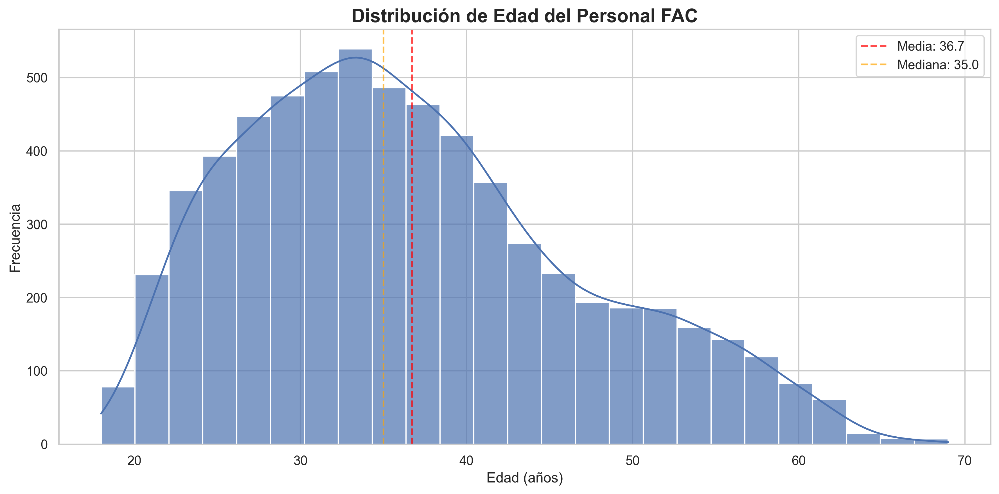
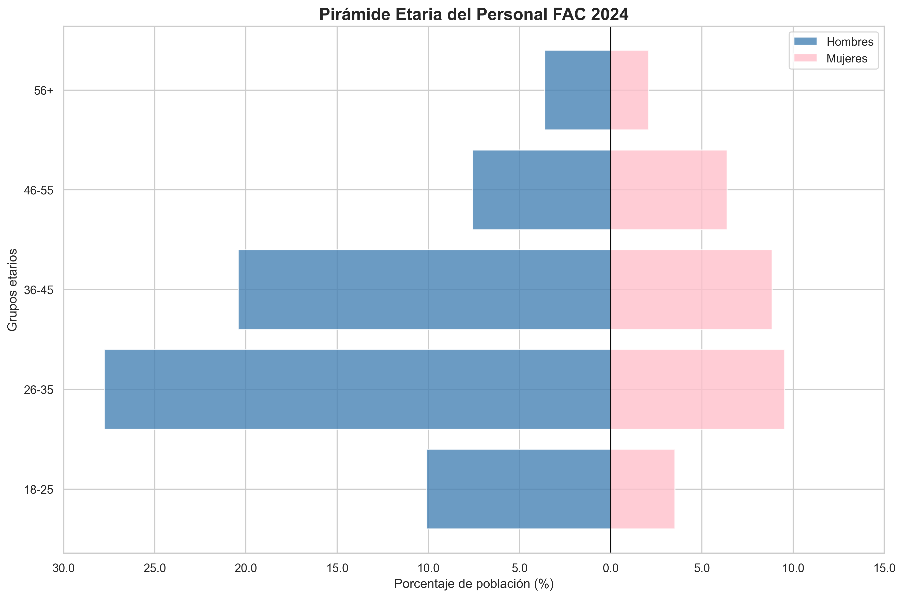
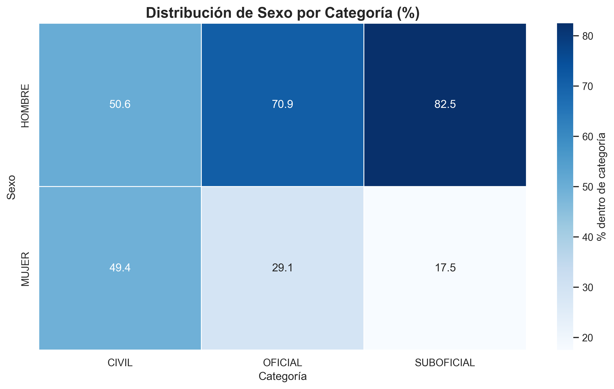
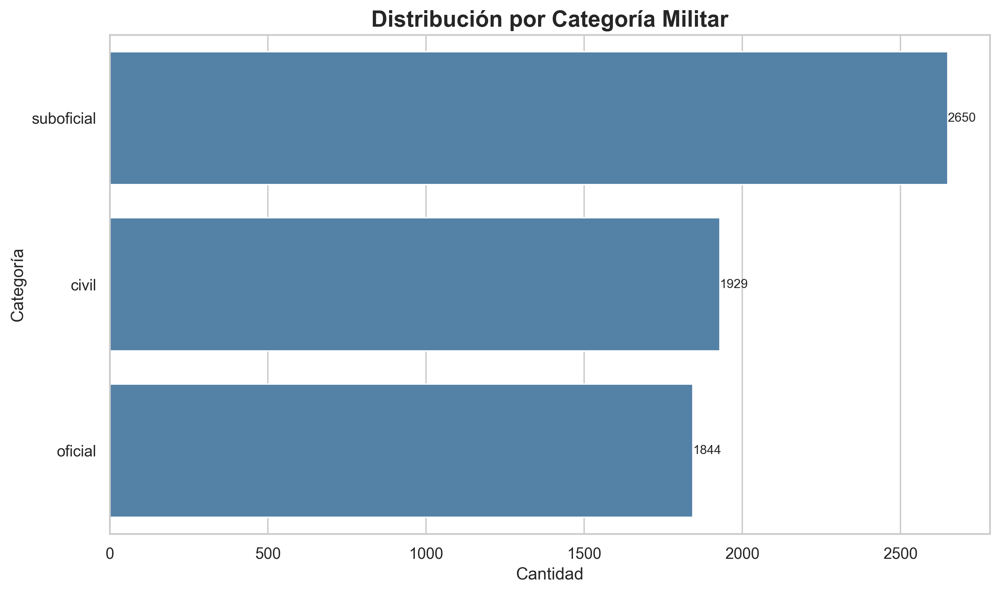
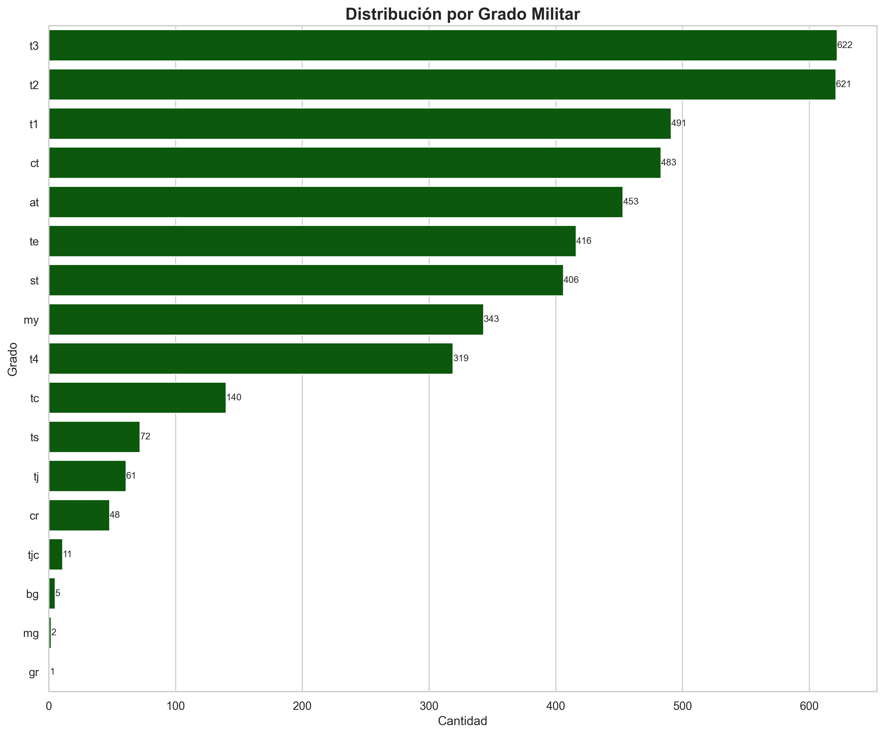
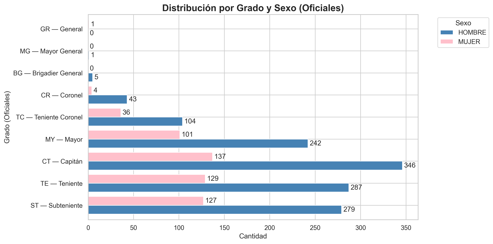
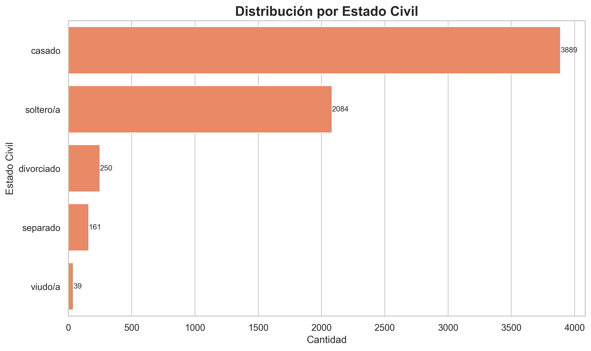
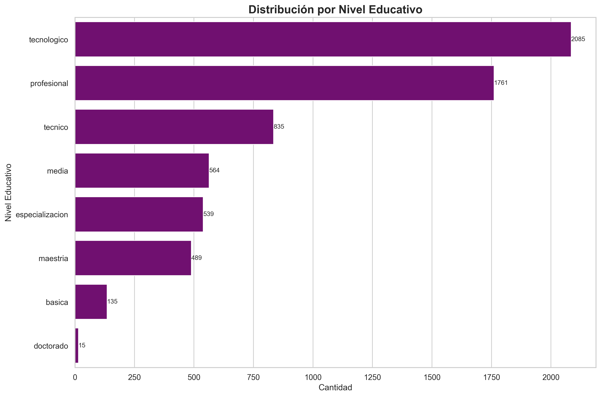
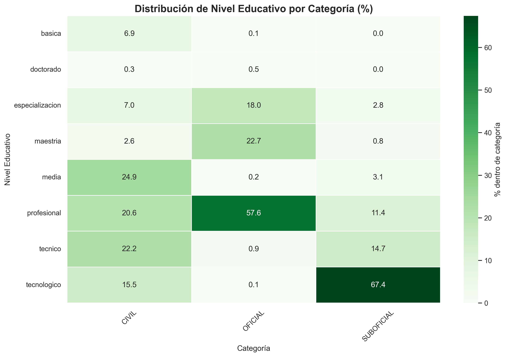

# Informe de Resultados Obtenidos  

**Base de Datos:** Fuerza Aérea Colombiana (FAC)  
**Responsable:**  
- Angela Rico: Análisis de demografía básica.  
- Ángela Tatiana Orjuela: Análisis de estructura familiar.  
- Karen Juliana Suárez Cruz: Calidad de datos  
**Fecha:** 29/08/2025  

---

# Calidad de Datos

## 1. ¿Qué columnas tienen más datos faltantes?  

#### Datos faltantes

En el análisis exploratorio de la base, se identificaron altos porcentajes de valores nulos en distintas variables. Las diez columnas con mayor afectación se presentan en la siguiente tabla:.

| Columna                                  | Datos Faltantes | %      |
| ---------------------------------------- | --------------- | ------ |
| NUMERO\_PERSONAS\_APORTE\_SOSTENIMIENTO2 | 3928            | 61.16% |
| NUMERO\_HABITAN\_VIVIENDA2               | 3808            | 59.29% |
| NUMERO\_HIJOS                            | 3217            | 50.09% |
| HIJOS\_EN\_HOGAR                         | 3200            | 49.82% |
| EDAD\_RANGO\_PADRE                       | 1939            | 30.19% |
| EDAD\_PADRE                              | 1939            | 30.19% |
| EDAD\_RANGO\_MADRE                       | 889             | 13.84% |
| EDAD\_MADRE                              | 885             | 13.78% |
| EDAD2                                    | 13              | 0.20%  |
| EDAD\_RANGO                              | 13              | 0.20%  |

####  Duplicados

No se identificaron registros duplicados, lo cual asegura que la base no presenta redundancias directas en sus observaciones.

####  Tipos de datos

En cuanto a los tipos de variables, se observa que la mayor parte corresponde a datos numéricos enteros (153 variables), seguidos por variables categóricas de texto (66) y un menor número de variables numéricas decimales (12). Esta distribución refleja la predominancia de información cuantitativa en la base.

#### Problemas de codificación

No se detectaron columnas con errores de codificación en los nombres de las variables. Sin embargo, se identificaron inconsistencias en los valores de texto dentro de algunas categorías, lo que será objeto de depuración en etapas posteriores.

---

## Limpieza de variables categóricas

Durante la depuración de la base se identificaron inconsistencias en las variables categóricas asociadas a cadenas de texto. Estas inconsistencias estaban relacionadas con el uso de acentos, mayúsculas, caracteres especiales y variaciones en la escritura, lo que generaba un aumento artificial del número de categorías.

### Proceso de limpieza

#### Normalización de cadenas
- Conversión de todos los valores a minúsculas.  
- Eliminación de tildes y caracteres extraños producto de errores de codificación.  
- Estandarización de espacios en blanco y símbolos innecesarios.  

#### Unificación de categorías equivalentes
- Se detectaron registros que, aunque distintos en su escritura, correspondían a la misma categoría.  
- Estos se homologaron bajo un valor canónico único, reduciendo la dispersión de categorías y garantizando mayor coherencia.  

### Resultados de la depuración
- Reducción significativa de categorías redundantes.  
- Mayor uniformidad en la clasificación de registros.  
- Preparación de las variables categóricas para análisis posteriores sin sesgos por errores de digitación o codificación.  

---

##  Imputaciones lógicas

Se aplicaron reglas de consistencia entre variables relacionadas con el fin de reducir incoherencias internas en los registros.

### Reglas aplicadas

- **HIJOS y NUMERO_HIJOS**  
  - Cuando `HIJOS = "no"` y `NUMERO_HIJOS = NA`, se imputó con **0**.  
  - **2.754 registros corregidos.**

- **HIJOS y HIJOS_EN_HOGAR**  
  - Misma regla anterior.  
  - **2.754 registros corregidos.**

- **MADRE_VIVE y EDAD_MADRE / RANGO_EDAD_MADRE**  
  - Cuando la madre estaba fallecida y la edad no estaba registrada, se imputó con **0**.  
  - **750 registros corregidos.**

- **PADRE_VIVE y EDAD_PADRE / RANGO_EDAD_PADRE**  
  - Mismo criterio aplicado.  
  - **1.797 registros corregidos.**
 
    En esta fase no me limité únicamente a aplicar reglas lógicas, sino que también recurrí a técnicas estadísticas más robustas.  

Primero, como ya conté, realicé las imputaciones simples: completé con cero los casos donde `HIJOS = "no"` y `NUMERO_HIJOS` estaba vacío, lo mismo con `HIJOS_EN_HOGAR`. También ajusté los registros de los padres y madres fallecidos, asignando cero en las variables de edad cuando correspondía. Estos pasos me ayudaron a alinear la información básica y reducir incoherencias.  

Sin embargo, para resolver los faltantes en variables numéricas más complejas, decidí aplicar **MICE (Multivariate Imputation by Chained Equations)**. En el código configuré el `IterativeImputer` con una semilla fija (`random_state = 42`) para asegurar la reproducibilidad de los resultados. Este método lo escogí porque me permite **imputar de manera iterativa cada variable faltante en función de todas las demás**, lo que aprovecha al máximo las correlaciones entre variables.  

En la práctica, MICE funciona construyendo un modelo de regresión para cada variable con datos faltantes y lo actualiza en varias iteraciones. Así, no se rellenan los vacíos con medias globales o medianas que pueden distorsionar la variabilidad, sino que cada imputación está condicionada a la información disponible de los demás campos del individuo.  

Opté por MICE en lugar de usar un método basado en componentes principales (como PCA o ACP) porque mi interés principal era **preservar la estructura original de las variables**, no reducir la dimensionalidad. El PCA es muy útil cuando se quiere sintetizar la información en menos dimensiones, pero al hacerlo se pierde interpretabilidad directa sobre cada variable. En cambio, con MICE mantuve intacto el significado de las variables originales, logrando imputaciones más naturales y fáciles de interpretar en el análisis posterior.  

Además, al trabajar con un dataset sociodemográfico amplio (más de 200 variables) MICE me dio la ventaja de **capturar relaciones complejas entre factores familiares, sociales y educativos** que difícilmente se reflejarían en un promedio simple o en una reducción por componentes.  

Con este procedimiento:  
- Pude completar prácticamente todos los valores faltantes en variables numéricas.  
- Trunqué los valores negativos a cero para evitar inconsistencias.  
- Respeté los ceros reales que representan situaciones lógicas (por ejemplo, padres fallecidos).  
- Reconstruí coherentemente los rangos de edad de padre y madre con base en las imputaciones numéricas.  

El resultado fue una base mucho más sólida: las distribuciones de las variables imputadas se alinearon con lo esperado, se redujo la proporción de faltantes a menos del 2% en algunos rangos categóricos, y lo más importante, logré mantener la **coherencia semántica** de cada variable.  

---

## Re-análisis post-limpieza

Después de las correcciones, los porcentajes de datos faltantes se redujeron significativamente:

| Columna                              | Datos Faltantes | Porcentaje |
|--------------------------------------|----------------|------------|
| NUMERO_PERSONAS_APORTE_SOSTENIMIENTO2 | 3928           | 61.16%     |
| NUMERO_HABITAN_VIVIENDA2             | 3808           | 59.29%     |
| NUMERO_HIJOS                          | 463            | 7.21%      |
| HIJOS_EN_HOGAR                        | 446            | 6.94%      |
| EDAD_RANGO_PADRE                      | 142            | 2.21%      |
| EDAD_PADRE                            | 142            | 2.21%      |
| EDAD_RANGO_MADRE                      | 139            | 2.16%      |
| EDAD_MADRE                            | 135            | 2.10%      |

En particular, el caso de la columna **NUMERO_PERSONAS_APORTE_SOSTENIMIENTO2** fue el más relevante, pues presenta un nivel de vacíos superior al 61%. Al no existir información complementaria que permitiera reconstruir los datos de manera confiable, la variable perdió valor analítico. Además, en la discusión con el equipo de trabajo se concluyó que esta columna no sería necesaria para los análisis posteriores, por lo que no se optó por ningún proceso de imputación.

Por otro lado, en la columna **NUMERO_HABITAN_VIVIENDA2** el porcentaje de datos faltantes alcanzó el 59%. Aunque en la base se encontraron algunas variables relacionadas (como aquellas que indican si la persona vive con hermanos mediante respuestas binarias de 1 o 0), estas no ofrecían información suficiente para estimar el número real de personas en la vivienda. De hecho, intentar una imputación con base en estas variables generaría inconsistencias y errores metodológicos. A esto se suma que, tras revisar los casos marcados como “no responde”, se evidenció que corresponden al 96% de los vacíos, lo que confirmó la baja confiabilidad de este campo.

En consecuencia, tanto en **NUMERO_PERSONAS_APORTE_SOSTENIMIENTO2** como en **NUMERO_HABITAN_VIVIENDA2** se decidió no aplicar estrategias de imputación. El alto nivel de vacíos, la falta de información auxiliar y el riesgo de introducir sesgos en el análisis justifican esta decisión. Estas variables fueron descartadas en la etapa de preprocesamiento, priorizando la calidad de la información que sí cuenta con una base sólida para su análisis estadístico.

---

## 2. ¿Hay registros duplicados?  

No se encontraron registros duplicados en la base de datos.  
Esto asegura que **cada fila corresponde a un individuo único**, aumentando la confiabilidad del análisis posterior.  

---

## 3. ¿Qué problemas de encoding se detectan?  

Durante la revisión se identificaron inconsistencias en la codificación de caracteres en variables categóricas, por ejemplo:  

- `"TECNOLÓGICO"` en lugar de `"TECNOLÓGICO"`.  

Estos errores pueden generar categorías redundantes y afectar los análisis de frecuencia.  
Para solucionarlo se aplicó un proceso de **normalización de texto**, estandarizando acentos y eliminando caracteres especiales.  

---

## Conclusiones  

1. La depuración permitió reducir los vacíos genuinos en variables clave, mejorando la calidad de la base.  
2. Los faltantes detectados en variables como *NUMERO_HABITAN_VIVIENDA2* no son aleatorios, sino coherentes con respuestas previas de “No responde”.  
3. La ausencia de duplicados garantiza que cada registro corresponde a un individuo único.  
4. La corrección de problemas de encoding aumenta la consistencia de las variables categóricas.  

---

# Análisis Demográfico

# Informe de Análisis Demográfico FAC 2024

## Introducción
El presente informe expone los principales hallazgos del análisis demográfico del personal de la Fuerza Aeroespacial Colombiana (FAC) a partir de la base de datos **JEFAB_2024_corregido.xlsx**, procesada mediante el script `analisis_demografico.py`.  
El archivo contiene **6.423 registros** y **231 variables**, que tras limpieza y normalización se consolidaron en 237 columnas listas para análisis.  

El objetivo es describir la composición de la población en variables claves como edad, sexo, categoría, grado militar, estado civil y nivel educativo, así como explorar asociaciones entre estas dimensiones mediante técnicas estadísticas básicas y visualizaciones gráficas.

---

## Perfil poblacional
El conjunto de datos muestra un personal con **edad promedio de 36.7 años**, **mediana de 35** y un rango de **18 a 69 años**.  
La **distribución por categoría** ubica a los **suboficiales como el grupo más numeroso (2.650, 41.3%)**, seguidos de **civiles (1.929, 30.0%)** y **oficiales (1.844, 28.7%)**.  

Estas cifras evidencian que la estructura institucional se apoya principalmente en los suboficiales, mientras que civiles y oficiales mantienen una proporción similar cercana al 30 % cada uno.

---

## Índices demográficos especializados
El script calcula tres indicadores clave para resumir la estructura demográfica:

1. **Índice de masculinidad**  
   - **Fórmula:** (Nº hombres / Nº mujeres) × 100  
   - **Resultado:** **228.9** → por cada 100 mujeres hay 229 hombres.  
   - **Interpretación:** predominio masculino pronunciado en la institución.  

2. **Índice de dependencia**  
   - **Definición en el script:** (jóvenes <30 + mayores ≥50) / (población activa 30–49) × 100  
   - **Resultado:** **68.2 %**.  
   - **Interpretación:** por cada 100 personas en edad activa hay 68 en los extremos etarios. Mide la carga relativa sobre el tramo operativo.  

3. **Coeficiente de variación etaria (CV)**  
   - **Fórmula:** (desviación estándar / media) × 100  
   - **Resultado:** **27.6 %**.  
   - **Interpretación:** la edad presenta una variabilidad moderada, aunque el centro de la distribución se mantiene claro (mediana 35 años).  

Además, al comparar categorías, se observa que la **mediana de edad de los civiles es 48 años**, mucho mayor que la de **oficiales y suboficiales (32 años)**.

---

## Estructura etaria
**Distribución general por grupos de edad:**
- 18–25 años: 13.6 %  
- 26–35 años: 37.3 %  
- 36–45 años: 29.3 %  
- 46–55 años: 13.9 %  
- 56+ años: 5.7 %  

El grupo modal corresponde a **26–35 años**, que concentra más de un tercio del total.

**Gráfico: Distribución de la edad**  

**Gráfico: Pirámide etaria por sexo**  

En la pirámide etaria se observa predominio masculino en todos los tramos, con mayor presencia femenina en edades intermedias (26–45 años).  
Los mayores de 55 años son minoritarios (5.7 %), lo que evidencia una población predominantemente joven-adulta.

---

## Composición por sexo
Del total de efectivos, **4.470 son hombres (69.6%) y 1.953 son mujeres (30.4%)**.  
Esto confirma la brecha de género señalada por el índice de masculinidad.

**Gráfico 08. Distribución de sexo por categoría (heatmap)**  

El heatmap muestra que en los **civiles la proporción es casi equilibrada**, mientras que en los **oficiales** predominan los hombres (71 %) y en los **suboficiales** la diferencia es aún mayor (83 %).  
La mayor inequidad de género se presenta en los  militares

---

## Categorías y grados
La distribución general por categoría ya señaló el peso de los suboficiales. El análisis por grado permite detallar la estructura jerárquica.

**Gráfico: Distribución por categoría**  

**Gráfico: Distribución por grado**  

Los grados más frecuentes son **T3, T2 y T1 (suboficiales técnicos)**, lo que configura la base de la pirámide jerárquica.  
Los grados superiores (coroneles y generales) concentran un número muy reducido de personas.

**Gráfico: Distribución por grado y sexo (oficiales)**  

El análisis jerárquico revela que **las mujeres tienen mayor presencia en grados iniciales**, pero prácticamente desaparecen en la cúspide de oficiales y suboficiales. Esto muestra un **“techo de cristal”** en la progresión de la carrera militar.

---

## Estado civil
La mayoría del personal está **casado (61 %)**, seguido por los **solteros (32 %)**.  
Separados, divorciados y viudos representan apenas un 7 %.

**Gráfico: Distribución por estado civil**  

La tendencia se mantiene en hombres y mujeres, lo que indica que la institución está compuesta mayoritariamente por familias constituidas, con implicaciones directas en la demanda de programas de bienestar.

---

## Nivel educativo
El nivel educativo refleja un capital humano diverso:

- Tecnológico: 2.085  
- Profesional: 1.761  
- Otros niveles (técnico, media, básica): menores proporciones  
- Posgrados (especialización, maestría, doctorado): minoritarios, concentrados en oficiales  

**Gráfico 05. Distribución por nivel educativo**  

**Gráfico 09. Heatmap de educación por categoría**  

El heatmap muestra que los **suboficiales se concentran en formación tecnológica**, los **oficiales en formación profesional y posgrados**, y los **civiles en una mezcla más heterogénea** con peso en secundaria/media.  
Esto refleja trayectorias educativas diferenciadas según la función institucional.

---

## Asociaciones y diferencias significativas
El módulo estadístico del script aplicó pruebas de independencia y comparaciones de medias para validar patrones:

- **Sexo × Categoría:** asociación moderada (V de Cramér = 0.290).  
- **Grupo etario × Categoría:** asociación fuerte (V = 0.504).  
- **Estado civil × Sexo:** asociación moderada (V = 0.153).  
- **Nivel educativo × Categoría:** asociación fuerte (V = 0.638).  

Adicionalmente:  
- **Edad promedio H vs M:** diferencia de -2.8 años (mujeres más jóvenes), resultado muy significativo.  
- **ANOVA edad por categoría:** diferencias muy significativas; los civiles son más mayores que oficiales y suboficiales.

Estas pruebas confirman que **las diferencias observadas en los gráficos no son aleatorias**, sino sistemáticas y estadísticamente sólidas.

---

## Respuestas a preguntas clave
1. **Rango de edad más común:** entre 28 y 33 años.  
2. **Distribución por género:** Hombres = 69.6 % · Mujeres = 30.4 %.  
3. **Grado más frecuente:** T3 – Suboficial Técnico Tercero (622 efectivos).  
4. **Categoría predominante:** Suboficial (2.650 efectivos, 41.3 %).  

---

## Conclusiones estratégicas
- La FAC cuenta con un **bono demográfico joven-adulto (25–35 años)**, que garantiza capacidad operativa actual, pero demanda planificación de relevos en el mediano plazo.  
- Se confirma un **predominio masculino fuerte**, especialmente en cargos militares, y la existencia de un **techo de cristal** que limita la progresión de las mujeres hacia los grados superiores.  
- La **estructura institucional descansa en los suboficiales**, particularmente en los grados técnicos T3, T2 y T1.  
- La alta proporción de **casados (61 %)** muestra la relevancia de los programas familiares y de conciliación laboral.  
- El **capital humano combina formación técnica-tecnológica en la base y profesional/posgrado en los mandos**, evidenciando una escalera formativa institucionalizada.  
- Las asociaciones estadísticas refuerzan que **sexo, edad y educación están fuertemente ligados a la categoría**, lo que exige políticas diferenciadas de gestión del talento humano.  

---

## Recomendaciones
- **Aprovechar el bono demográfico actual** con planes de capacitación y retención del talento joven.  
- **Fortalecer políticas de equidad de género**, removiendo barreras para la promoción de mujeres en la carrera militar.  
- **Planificar el relevo generacional**, considerando la mayor edad promedio del personal civil.  
- **Impulsar programas de desarrollo profesional** en línea con las trayectorias educativas identificadas.  
- **Atender la alta conyugalidad** con políticas de bienestar familiar y vivienda.  

---

# Análisis Familiar 

Este proyecto realiza un análisis exploratorio de datos (EDA) centrado en variables sociodemográficas y familiares.  
El objetivo es identificar patrones y relaciones relevantes sobre **estado civil, hijos, convivencia familiar, maltrato intrafamiliar, vivienda propia y relaciones de pareja**, con el fin de comprender mejor el bienestar familiar y las dinámicas familiares dentro de la población estudiada.  
Se incluyen visualizaciones que facilitan la interpretación de los resultados y permiten detectar tendencias y asociaciones clave de manera rápida.

## Estado Civil

### Distribución absoluta y porcentual
| Estado Civil | Frecuencia | Porcentaje |
|--------------|------------|------------|
| Casado       | 3889       | 60.55%     |
| Soltero/a    | 2084       | 32.45%     |
| Divorciado   | 250        | 3.89%      |
| Separado     | 161        | 2.51%      |
| Viudo/a      | 39         | 0.61%      |

- La mayoría de las personas están **casadas (60.55%)** o **solteras/as (32.45%)**.  
- Los estados de **divorciado, separado y viudo/a** son minoritarios.  
- Los **viudos/as** presentan el porcentaje más alto de vivienda propia (47.56%), mientras que los **solteros/as** tienen el porcentaje más bajo (30.22%).

### Edad promedio según ESTADO_CIVIL

| Estado Civil           | Edad media |
|-----------------------|------------|
| Soltero/a             | 30.24      |
| Casado                | 39.71      |
| Divorciado/Separado   | 40.56      |
| Viudo/a               | 47.56      |

#### Comparaciones significativas (Dunn): La prueba de Kruskal-Wallis mostró diferencias estadísticamente significativas en la edad según el estado civil (p < 0.05).
La prueba post hoc de Dunn (con corrección de Bonferroni) identificó qué grupos presentan diferencias significativas.

| Comparación                    | p-valor  | ¿Significativa? | Interpretación |
|------------------------------|----------|-----------------|----------------|
| Casado vs Soltero/a           | < 0.001  | ✅ Sí           | Solteros/as son significativamente **más jóvenes** que casados |
| Casado vs Viudo/a             | 0.0001   | ✅ Sí           | Viudos/as son significativamente **mayores** que casados |
| Divorciado/Separado vs Soltero/a | < 0.001 | ✅ Sí          | Solteros/as son significativamente **más jóvenes** que divorciados/separados |
| Divorciado/Separado vs Viudo/a   | 0.0041  | ✅ Sí           | Viudos/as son significativamente **mayores** que divorciados/separados |
| Soltero/a vs Viudo/a          | < 0.001  | ✅ Sí           | Viudos/as son significativamente **mayores** que solteros/as |
| Casado vs Divorciado/Separado | 0.115    | ❌ No           | No hay diferencias significativas |

####  Conclusión:

Las edades difieren significativamente entre la mayoría de los grupos de estado civil. En términos generales:

- **Solteros/as** son los más jóvenes.
- **Viudos/as** son los más mayores.
- **Casados** y **divorciados/separados** tienen edades similares entre sí, sin diferencias significativas.

Este patrón es consistente con las etapas de la vida y puede guiar intervenciones enfocadas según el estado civil y edad en bienestar familiar.

## Hijos

| Tiene Hijos | Frecuencia |
|-------------|------------|
| Sí          | 3669       |
| No          | 2754       |

- La mayoría del personal **tiene hijos (3669 personas, ~57%)**.  
- Tener hijos está asociado a **mayor probabilidad de vivienda propia**, aunque **no implica necesariamente mayor convivencia con la familia**.

## Analisis hijos vivienda propia

###  Análisis Chi-cuadrado: Asociación entre Tener Hijos y Vivienda Propia

**Hipótesis:**

- **H₀ (Hipótesis nula):** No existe asociación entre tener hijos y la tenencia de vivienda propia. Es decir, las variables **HIJOS** y **VIVIENDA_PROPIA** son independientes.
- **H₁ (Hipótesis alternativa):** Existe una asociación entre tener hijos y la tenencia de vivienda propia. Las variables no son independientes.

**Resultado del test:**

- Estadístico Chi-cuadrado: **χ² = 604.73**
- Valor-p: **p < 0.001**

**Conclusión:**

Dado que el valor-p es menor a 0.05, se **rechaza la hipótesis nula**. Por lo tanto, se concluye que existe una **asociación estadísticamente significativa** entre tener hijos y la posesión de vivienda propia.

Este hallazgo sugiere que la decisión o posibilidad de adquirir vivienda puede estar relacionada con la condición de ser padre o madre, lo cual puede tener implicaciones en políticas de vivienda, planificación familiar y desarrollo social.

### Interpretación grafico
- Entre quienes **no tienen hijos**, la mayoría no posee vivienda propia (~75%).  
- Más del **55% de quienes tienen hijos sí cuentan con vivienda propia**.  
- Esto indica que **tener hijos está asociado a una mayor probabilidad de adquirir vivienda**.

## Convivencia Familiar y Maltrato intrafamiliar

- La gran mayoría **no habita con su familia (81.56%)**, y solo un 18.44% convive con ella.  
- El **maltrato intrafamiliar ocurre tanto en quienes habitan como en quienes no habitan con la familia**, aunque la mayoría de los casos está entre quienes no conviven con la familia.

## Relaciones Familiares y de Pareja

### Porcentajes de HIJOS vs RELACION_PAREJA_ESTABLE

| HIJOS | RELACION_PAREJA_ESTABLE: No (%) | RELACION_PAREJA_ESTABLE: Sí (%) | Total |
|-------|---------------------------------|--------------------------------|-------|
| no    | 41.0                            | 59.0                           | 2754  |
| sí    | 15.0                            | 85.0                           | 3669  |
| All   | 26.1                            | 73.9                           | 6423  |

- Tener hijos está **fuertemente asociado a tener una relación de pareja estable**.  
- La mayoría de las personas **tienen madre viva**, independientemente de tener hijos.  
- Entre quienes **tienen hijos**, hay más personas cuyo **padre ha fallecido** comparado con quienes no tienen hijos.

## analisis categoria y maltrato intrafamiliar

### Porcentajes por categoría

| CATEGORIA   | No (%) | Sí (%) |
|------------|--------|--------|
| civil      | 92.6   | 7.4    |
| oficial    | 96.8   | 3.2    |
| suboficial | 96.3   | 3.7    |

Los casos de maltrato intrafamiliar son mucho más frecuentes en la categoría civil que en las categorías oficial y suboficial .

Las categorías oficiales y suboficiales tienen una baja incidencia de maltrato intrafamiliar en comparación con la categoría civil .

## Distribución de Categoría por Estado Civil

###  Análisis Chi-cuadrado: Asociación entre Estado Civil y Categoría

**Hipótesis:**

- **H₀ (Hipótesis nula):** No existe asociación entre el estado civil y la categoría laboral. Es decir, las variables **ESTADO_CIVIL** y **CATEGORÍA** son independientes.
- **H₁ (Hipótesis alternativa):** Existe una asociación entre el estado civil y la categoría laboral. Las variables no son independientes.

**Resultado del test:**

- Estadístico Chi-cuadrado: **χ² = 334.94**
- Valor-p: **p < 0.001**

**Conclusión:**

Dado que el valor-p es menor a 0.05, se **rechaza la hipótesis nula**. Se concluye que existe una **asociación estadísticamente significativa** entre el estado civil y la categoría laboral del personal.

Este resultado sugiere que la distribución de las categorías laborales varía según el estado civil, lo que podría reflejar diferencias estructurales o sociales dentro de la organización que merecen mayor análisis.

- En **casados y divorciados**, predomina la categoría **suboficial**, aunque la categoría civil también tiene un peso importante.  
- En **separados**, la mayoría pertenece a la categoría **civil**, seguida por suboficial.  
- Entre los **viudos/as** predomina ampliamente la categoría **civil (más del 80%)**, mientras que en los **solteros/as** hay mayor equilibrio, destacando **suboficial y oficial**.

