# Análisis demográfico FAC 2024  
_Basado estrictamente en `analisis_demografico.py` y sus salidas (prints y figuras)._

## Datos y reglas
- Entrada: `JEFAB_2024_corregido.xlsx`.
- Variables usadas por el script: `EDAD2`, `SEXO`, `CATEGORIA`, `GRADO`, `ESTADO_CIVIL`, `NIVEL_EDUCATIVO`.
- “Rango de edad más común”: `pd.cut(EDAD2, bins=10)` → 10 intervalos de **ancho igual** entre edad mínima y máxima.
- En cruces con **GRADO** y en **NIVEL_EDUCATIVO × GRADO**, el script **excluye** `"no responde"` antes de contar/graficar.

## Indicadores impresos por el script
- **Edad mínima**: 18 años.  
- **Edad máxima**: 69 años.  
- **Edad promedio**: 36.7 años.  
- **Rango de edad más común** (bins=10): **25–34 años**.  
- **Distribución por sexo**: HOMBRES = **4470**; MUJERES = **1953**.  
- **Grado militar más frecuente** (moda de `GRADO` sin “no responde”): **T3 — Suboficial Técnico Tercero (Suboficial)**.

> Las cifras anteriores provienen de los `print(...)` del archivo `.py` (“Pregunta 1”, “Pregunta 2” y “Pregunta 3”).

---

## Estructura por edad

**Evidencia:**  
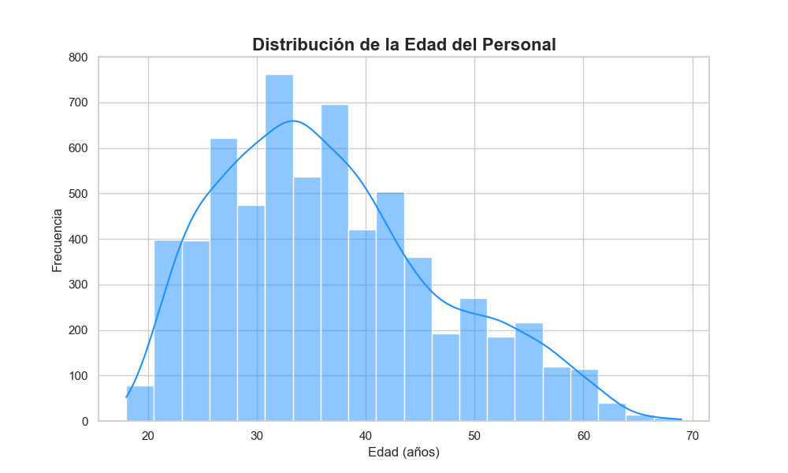

**Lectura:** histograma unimodal con mayor densidad en edades medias; los extremos son minoritarios.  
**Por qué es hallazgo:** define el centro etario del personal hace 2024 y sustenta decisiones operativas (turnos, formación inicial, retiro).

**Edad por género**  
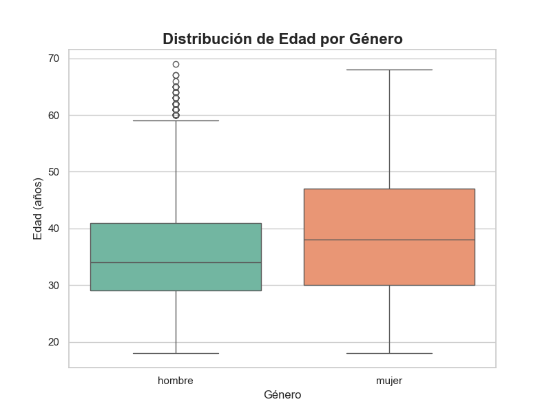

- Mediana femenina visualmente algo mayor; mayor dispersión superior.
- Justificación: líneas de mediana y rangos intercuartílicos en el boxplot.

**Edad por categoría**  
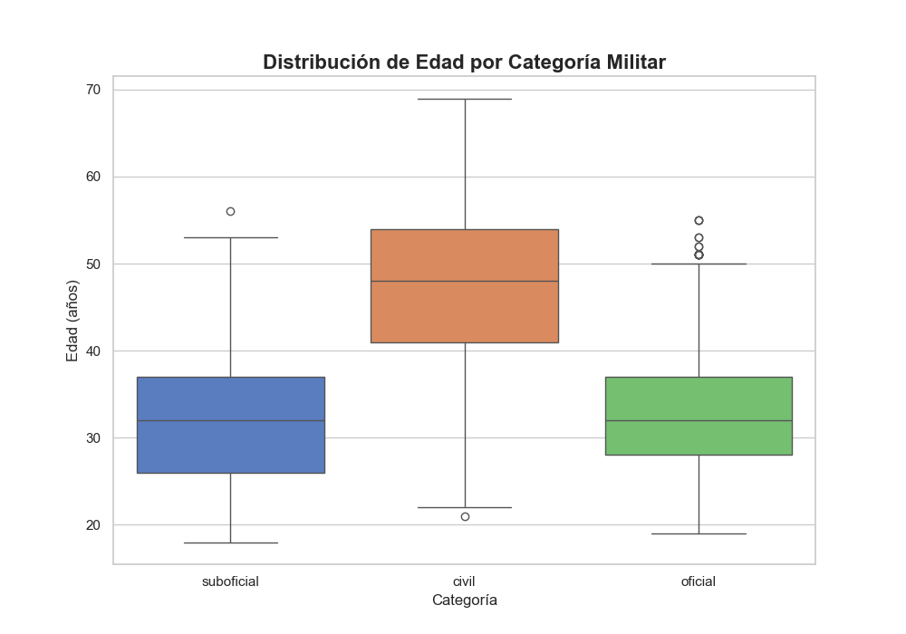

- **CIVIL** muestra mediana y dispersión más altas que **OFICIAL** y **SUBOFICIAL**.
- Justificación: posición de la línea de mediana y altura de la caja en el boxplot.

---

## Sexo

**Evidencia:**  
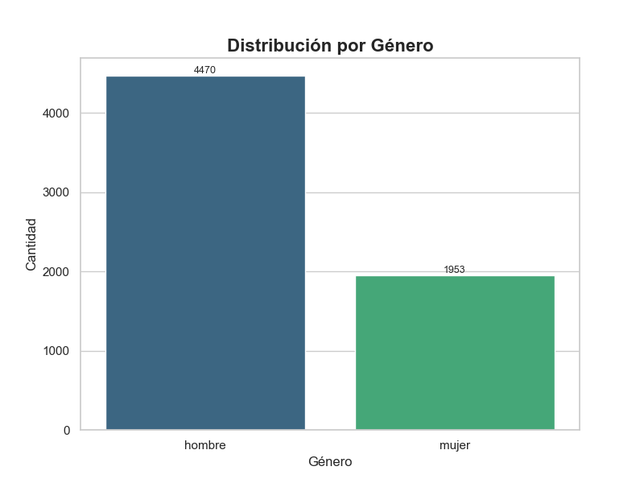

**Lectura:** predominio claro de HOMBRES (coincide con los conteos impresos).  
**Por qué es hallazgo:** la estructura está lejos de la paridad y condiciona composición por grados y áreas.

---

## Categoría y grado

**Distribución por categoría**  
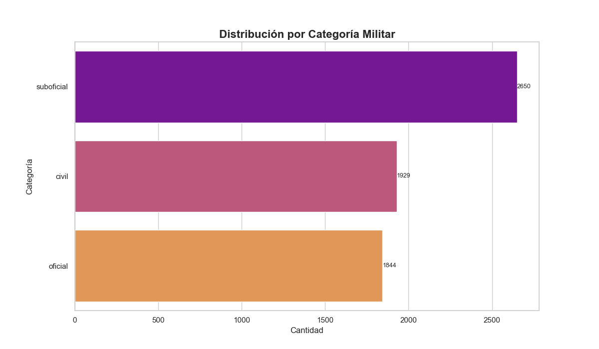

- **SUBOFICIAL** es la categoría más numerosa; luego **CIVIL** y **OFICIAL**.  
- Implicación: la base operativa se concentra en suboficiales.

**Distribución por grado (sin “no responde”)**  
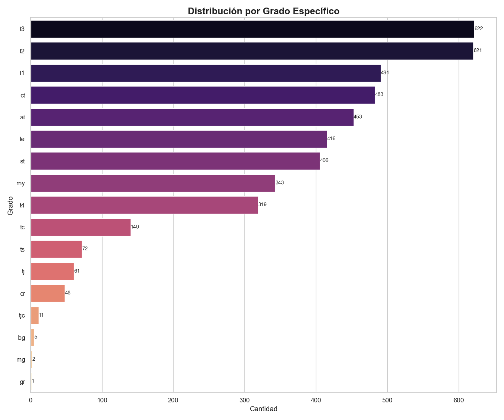

- Pirámide jerárquica típica: base amplia en **T3 — Suboficial Técnico Tercero (Suboficial)**, **T2 — Suboficial Técnico Segundo (Suboficial)** y **T1 — Suboficial Técnico Primero (Suboficial)**; cúpula muy reducida (**TC — Teniente Coronel (Oficial)**, **CR — Coronel (Oficial)**, **BG — Brigadier General (Oficial)**, **MG — Mayor General (Oficial)**, **GR — General (Oficial)**).
- Justificación: alturas decrecientes hacia los grados superiores.

**Grado × género (sin “no responde”)**  
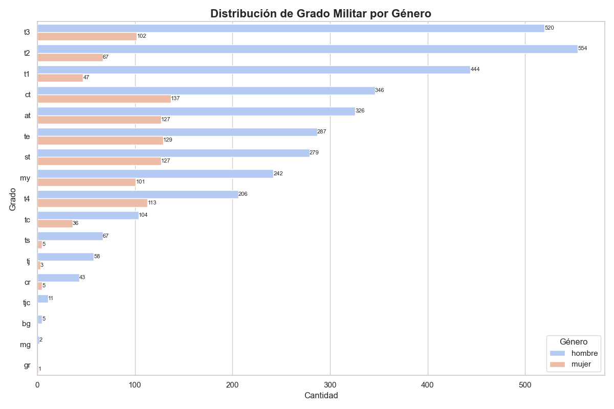

- En casi todos los grados la barra de **HOMBRES** es mayor; la brecha crece hacia la cúpula.  
- Justificación: contraste visual por grado y sexo en el gráfico.

---

## Estado civil

**Evidencia:**  
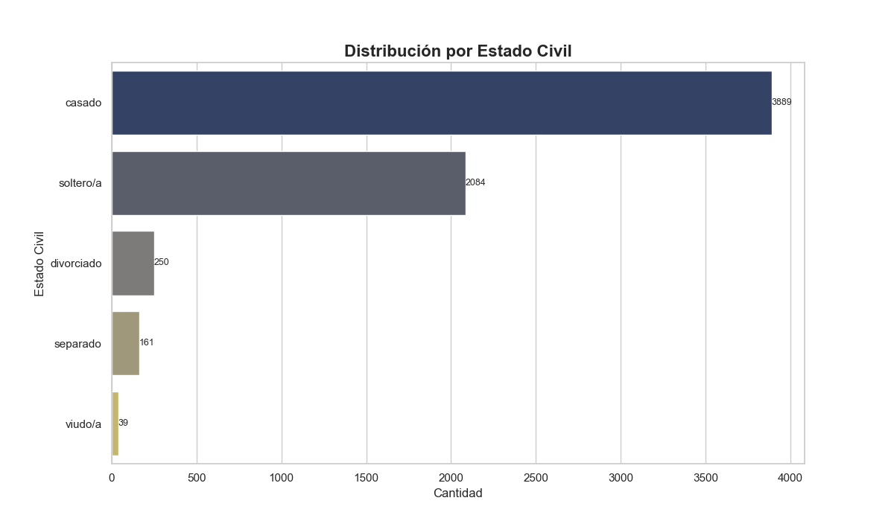  
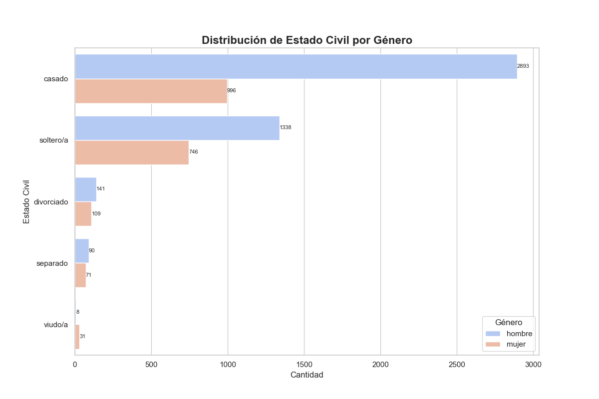

**Lectura:** **CASADO** domina en el total y dentro de cada sexo; **SOLTERO/A** es el segundo grupo.  
**Por qué es hallazgo:** implica demanda estable de prestaciones familiares y conciliación.

---

## Nivel educativo

**Distribución total**  
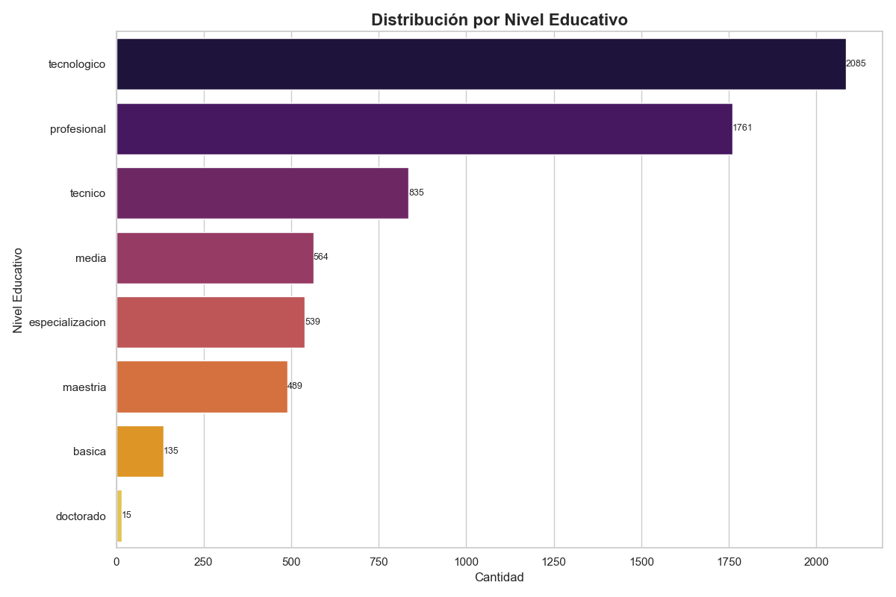

- Predominan **TÉCNICO/TECNOLÓGICO** y **PROFESIONAL**; posgrados existen pero con menor volumen.

**Nivel educativo × grado (ambos sin “no responde”)**  
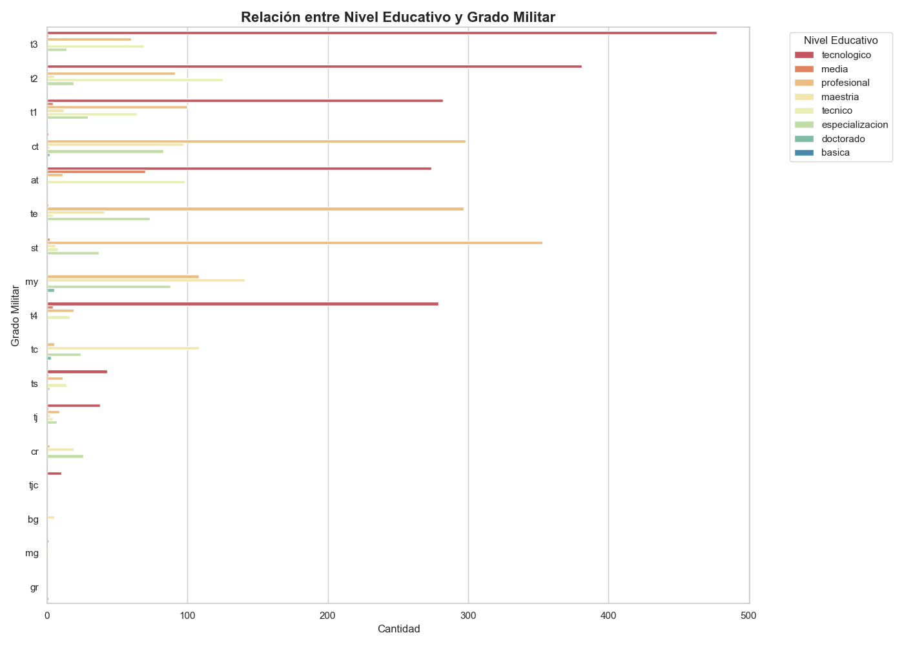

- Los grados de base (**AT — Aerotécnico (Suboficial)** a **T3 — Suboficial Técnico Tercero (Suboficial)**) concentran **técnico/tecnológico**.  
- En mandos (**CT — Capitán (Oficial)**, **MY — Mayor (Oficial)**, **TC — Teniente Coronel (Oficial)**) crece **profesional** y aparecen **posgrados**.  
- Justificación: cambio de composición de barras por grado.

---

## Síntesis para el contexto FAC
- **Perfil etario** centrado en 25–34; **CIVIL** es relativamente más mayor.  
- **Predominio masculino** confirmado por conteos.  
- **Base institucional** en **SUBOFICIALES** y en grados técnicos intermedios (**T3/T2/T1**).  
- **Conyugalidad alta**: “CASADO” domina en total y por sexo.  
- **Capital humano** con base técnico–profesional; posgrados en mandos.

## Notas metodológicas (del propio script)
- “Rango de edad más común” proviene de `pd.cut(EDAD2, bins=10)` (no son tramos demográficos fijos).  
- En **GRADO** y en **NIVEL_EDUCATIVO × GRADO** se excluye `"no responde"` antes de tabular y graficar.  
- Las cifras puntuales impresas (edad media/mín/máx, conteos por sexo, grado modal) deben tomarse tal como aparecen en la consola al ejecutar `analisis_demografico.py`.
