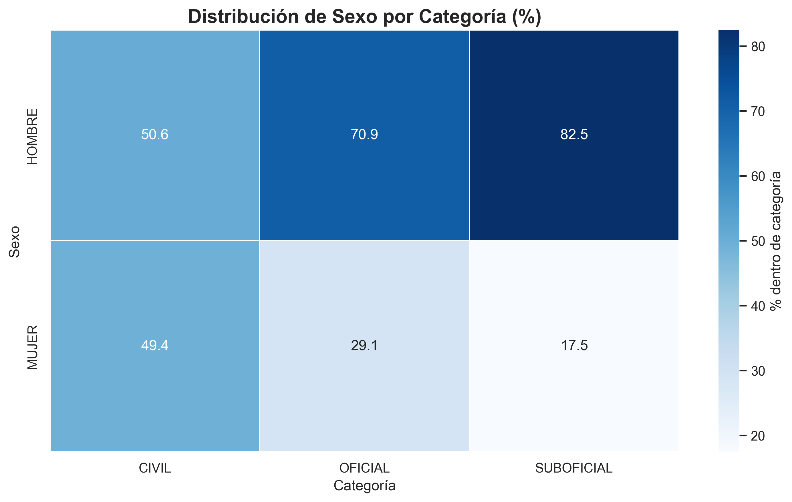
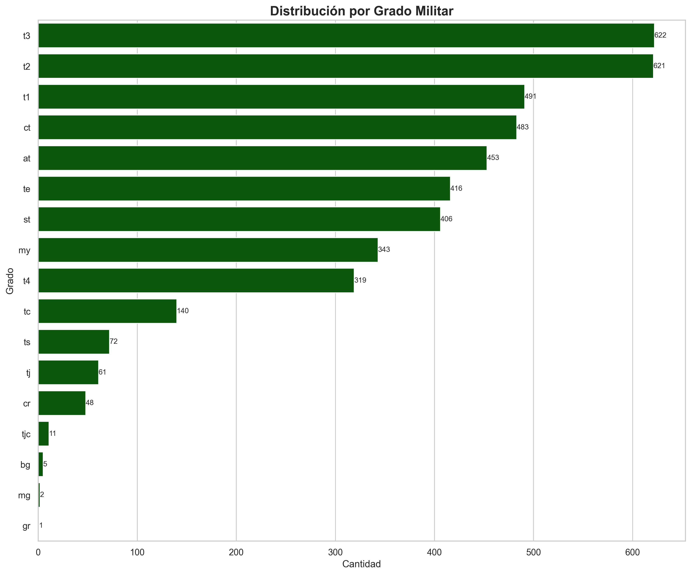
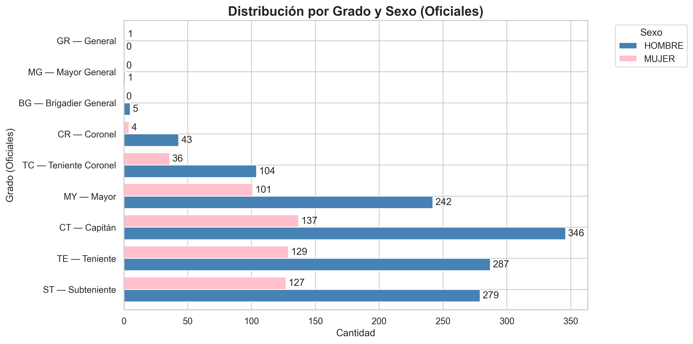
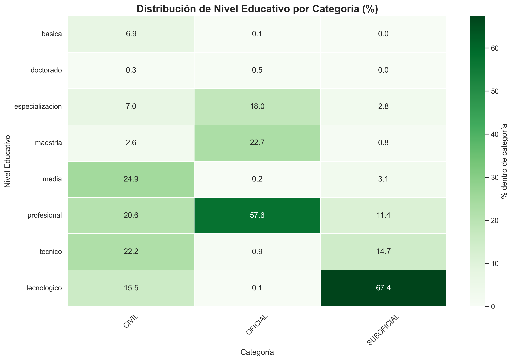

# Informe de Análisis Demográfico FAC 2024

## Introducción
El presente informe expone los principales hallazgos del análisis demográfico del personal de la Fuerza Aeroespacial Colombiana (FAC) a partir de la base de datos **JEFAB_2024_corregido.xlsx**, procesada mediante el script `analisis_demografico.py`.  
El archivo contiene **6.423 registros** y **231 variables**, que tras limpieza y normalización se consolidaron en 237 columnas listas para análisis.  

El objetivo es describir la composición de la población en variables claves como edad, sexo, categoría, grado militar, estado civil y nivel educativo, así como explorar asociaciones entre estas dimensiones mediante técnicas estadísticas básicas y visualizaciones gráficas.

---

## Perfil poblacional
El conjunto de datos muestra un personal con **edad promedio de 36.7 años**, **mediana de 35** y un rango de **18 a 69 años**.  
La **distribución por categoría** ubica a los **suboficiales como el grupo más numeroso (2.650, 41.3%)**, seguidos de **civiles (1.929, 30.0%)** y **oficiales (1.844, 28.7%)**.  

Estas cifras evidencian que la estructura institucional se apoya principalmente en los suboficiales, mientras que civiles y oficiales mantienen una proporción similar cercana al 30 % cada uno.

---

## Índices demográficos especializados
El script calcula tres indicadores clave para resumir la estructura demográfica:

1. **Índice de masculinidad**  
   - **Fórmula:** (Nº hombres / Nº mujeres) × 100  
   - **Resultado:** **228.9** → por cada 100 mujeres hay 229 hombres.  
   - **Interpretación:** predominio masculino pronunciado en la institución.  

2. **Índice de dependencia**  
   - **Definición en el script:** (jóvenes <30 + mayores ≥50) / (población activa 30–49) × 100  
   - **Resultado:** **68.2 %**.  
   - **Interpretación:** por cada 100 personas en edad activa hay 68 en los extremos etarios. Mide la carga relativa sobre el tramo operativo.  

3. **Coeficiente de variación etaria (CV)**  
   - **Fórmula:** (desviación estándar / media) × 100  
   - **Resultado:** **27.6 %**.  
   - **Interpretación:** la edad presenta una variabilidad moderada, aunque el centro de la distribución se mantiene claro (mediana 35 años).  

Además, al comparar categorías, se observa que la **mediana de edad de los civiles es 48 años**, mucho mayor que la de **oficiales y suboficiales (32 años)**.

---

## Estructura etaria
**Distribución general por grupos de edad:**
- 18–25 años: 13.6 %  
- 26–35 años: 37.3 %  
- 36–45 años: 29.3 %  
- 46–55 años: 13.9 %  
- 56+ años: 5.7 %  

El grupo modal corresponde a **26–35 años**, que concentra más de un tercio del total.

**Gráfico: Distribución de la edad**  

**Gráfico: Pirámide etaria por sexo**  

En la pirámide etaria se observa predominio masculino en todos los tramos, con mayor presencia femenina en edades intermedias (26–45 años).  
Los mayores de 55 años son minoritarios (5.7 %), lo que evidencia una población predominantemente joven-adulta.

---

## Composición por sexo
Del total de efectivos, **4.470 son hombres (69.6%) y 1.953 son mujeres (30.4%)**.  
Esto confirma la brecha de género señalada por el índice de masculinidad.

**Gráfico 08. Distribución de sexo por categoría (heatmap)**  

El heatmap muestra que en los **civiles la proporción es casi equilibrada**, mientras que en los **oficiales** predominan los hombres (71 %) y en los **suboficiales** la diferencia es aún mayor (83 %).  
La mayor inequidad de género se presenta en los  militares.

---

## Categorías y grados
La distribución general por categoría ya señaló el peso de los suboficiales. El análisis por grado permite detallar la estructura jerárquica.

**Gráfico: Distribución por categoría**  

**Gráfico: Distribución por grado**  

Los grados más frecuentes son **T3, T2 y T1 (suboficiales técnicos)**, lo que configura la base de la pirámide jerárquica.  
Los grados superiores (coroneles y generales) concentran un número muy reducido de personas.

**Gráfico: Distribución por grado y sexo (oficiales)**  

El análisis jerárquico revela que **las mujeres tienen mayor presencia en grados iniciales**, pero prácticamente desaparecen en la cúspide de oficiales y suboficiales. Esto muestra un **“techo de cristal”** en la progresión de la carrera militar.

---

## Estado civil
La mayoría del personal está **casado (61 %)**, seguido por los **solteros (32 %)**.  
Separados, divorciados y viudos representan apenas un 7 %.

**Gráfico: Distribución por estado civil**  

La tendencia se mantiene en hombres y mujeres, lo que indica que la institución está compuesta mayoritariamente por familias constituidas, con implicaciones directas en la demanda de programas de bienestar.

---

## Nivel educativo
El nivel educativo refleja un capital humano diverso:

- Tecnológico: 2.085  
- Profesional: 1.761  
- Otros niveles (técnico, media, básica): menores proporciones  
- Posgrados (especialización, maestría, doctorado): minoritarios, concentrados en oficiales  

**Gráfico 05. Distribución por nivel educativo**  

**Gráfico 09. Heatmap de educación por categoría**  

El heatmap muestra que los **suboficiales se concentran en formación tecnológica**, los **oficiales en formación profesional y posgrados**, y los **civiles en una mezcla más heterogénea** con peso en secundaria/media.  
Esto refleja trayectorias educativas diferenciadas según la función institucional.

---

## Asociaciones y diferencias significativas
El módulo estadístico del script aplicó pruebas de independencia y comparaciones de medias para validar patrones:

- **Sexo × Categoría:** asociación moderada (V de Cramér = 0.290).  
- **Grupo etario × Categoría:** asociación fuerte (V = 0.504).  
- **Estado civil × Sexo:** asociación moderada (V = 0.153).  
- **Nivel educativo × Categoría:** asociación fuerte (V = 0.638).  

Adicionalmente:  
- **Edad promedio H vs M:** diferencia de -2.8 años (mujeres más jóvenes), resultado muy significativo.  
- **ANOVA edad por categoría:** diferencias muy significativas; los civiles son más mayores que oficiales y suboficiales.

Estas pruebas confirman que **las diferencias observadas en los gráficos no son aleatorias**, sino sistemáticas y estadísticamente sólidas.

---

## Respuestas a preguntas clave
1. **Rango de edad más común:** entre 28 y 33 años.  
2. **Distribución por género:** Hombres = 69.6 % · Mujeres = 30.4 %.  
3. **Grado más frecuente:** T3 – Suboficial Técnico Tercero (622 efectivos).  
4. **Categoría predominante:** Suboficial (2.650 efectivos, 41.3 %).  

---

## Conclusiones estratégicas
- La FAC cuenta con un **bono demográfico joven-adulto (25–35 años)**, que garantiza capacidad operativa actual, pero demanda planificación de relevos en el mediano plazo.  
- Se confirma un **predominio masculino fuerte**, especialmente en cargos militares, y la existencia de un **techo de cristal** que limita la progresión de las mujeres hacia los grados superiores.  
- La **estructura institucional descansa en los suboficiales**, particularmente en los grados técnicos T3, T2 y T1.  
- La alta proporción de **casados (61 %)** muestra la relevancia de los programas familiares y de conciliación laboral.  
- El **capital humano combina formación técnica-tecnológica en la base y profesional/posgrado en los mandos**, evidenciando una escalera formativa institucionalizada.  
- Las asociaciones estadísticas refuerzan que **sexo, edad y educación están fuertemente ligados a la categoría**, lo que exige políticas diferenciadas de gestión del talento humano.  

---

## Recomendaciones
- **Aprovechar el bono demográfico actual** con planes de capacitación y retención del talento joven.  
- **Fortalecer políticas de equidad de género**, removiendo barreras para la promoción de mujeres en la carrera militar.  
- **Planificar el relevo generacional**, considerando la mayor edad promedio del personal civil.  
- **Impulsar programas de desarrollo profesional** en línea con las trayectorias educativas identificadas.  
- **Atender la alta conyugalidad** con políticas de bienestar familiar y vivienda.  

---
